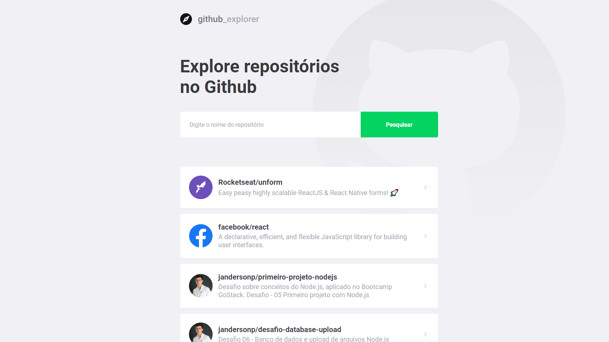

<h3 align="center">
  Github Explorer
</h3>

  <a href="#rocket-sobre-o-desafio">About the challenge</a>&nbsp;&nbsp;&nbsp;|&nbsp;&nbsp;&nbsp;

## :rocket: About the challenge
In this project, we created an application to find repositories on GitHub from the GitHub API.

We use ReactJS concepts as a basis to create our Application Frontend

  

Made by Janderson Pizzially Vilas Boas (https://www.linkedin.com/in/jandersonvilasboas/)
